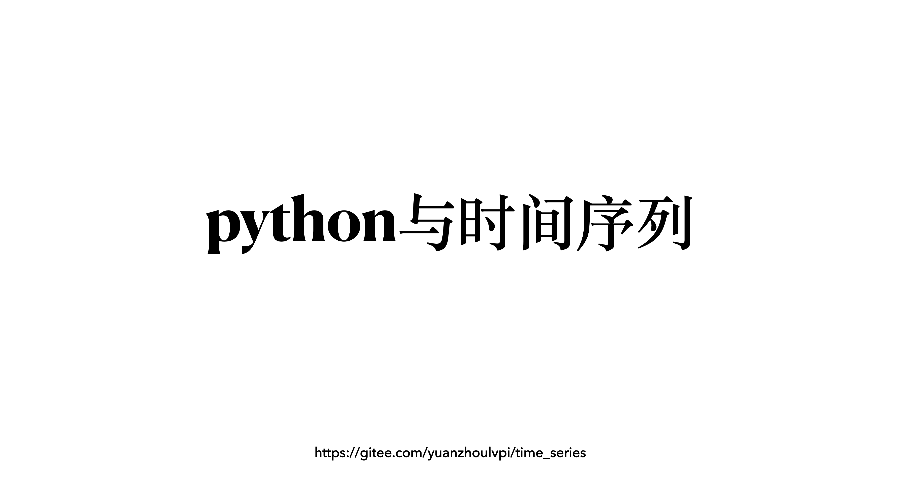

## python与时间序列

回看我之前的文章，涉及到的内容很多，比如统计学、计算机视觉、数据处理、数据可视化、编程自动化、多进程并行等等。但是我的历史文章，很少聚焦在什么一个特定问题上，或者聚焦在一个特定的学科范围内。

因为我感觉很多东西别人都做了，我想做一些不一样的，比如之前做了很多关于R语言的文章，但是写的都是非常浅；很多时候也都是去介绍非常牛逼的包。这就导致和别的公众号拉不开距离。因为别的公众号也可以写介绍牛逼包的文章。所以后来就放弃。

我重新看了看我的公众号粉丝的用户画像，很多都是因为之前的【时间序列】和【R语言】和【可视化】关注我的。可是这3个类目都是局限于R语言上面，这就导致相对于python用户群体来说，R用户群体还是有点小。

因此我决定要做时间序列和python的结合，详细、全面的介绍如何使用python做时间序列，如何使用python将时间序列落地。

将网络上的python时间序列重新整理，将【时间序列分析及其应用（第四版）】中的R部分替换成python，并且重新规划内容，达到一个python和时间序列有机结合的程度。

## 优势

我做的python与时间序列的系列文章的优势是什么：

### 数据优势

做过计量统计的同学肯定都经历过找数据的痛苦，而且有时候学习兴趣往往被找数据这个事情给冲淡。

那么我这里保证数据有出处，数据全部都聚合到一个文件夹中，方便大家查找。

并且数据完全公开免费，数据全部整理为txt、excel等文件格式，保证大家可以用得了，并且保证大家在国内也都用的了。

### 代码优势

代码倒是不用说了，我这里写的python和R代码行数也都超过数十万行了。用python和R处理过非常大、非常复杂的数据，这部分基本上不是难题。

另外有的时候代码风格千奇百怪，让人摸不着头脑，因此我会讲我的代码都封装好，保证每一个人用起来都没问题。

另外代码也都是免费、公开分享给每一位用户。

## 知识框架

1. 时间序列的数据处理；
2. 时间序列的可视化；
3. 时间序列的模型介绍及其python实现；
4. 网络的时间序列的文章整理翻译等；
5. python做时间序列的时候踩到的坑。

## 共享内容

### 之前
数据和代码内容，我会全部都放在【gitee】上，因为gitee相对于GitHub对中国用户来说，访问更加的便利。
链接为：[https://gitee.com/yuanzhoulvpi/time_series](https://gitee.com/yuanzhoulvpi/time_series)

### 现在

之前这个仓库都是放在我的gitee上的，想着中国好朋友可以访问方便一点，没想着在2022-05-17日发现，gitee竟然私自把
我的仓库搞成“当前仓库 Web 页面仅限仓库成员可访问” 我也是无语！！！！！

这样的肚量的企业有什么资格扛起中国开源的大旗，有什么资格和github做比较，垃圾至极！！！！

## 获得最新消息

1. 关注我的知乎：[yuanz](https://www.zhihu.com/people/fa-fa-1-94)
2. 关注我的公众号：
<!-- 
    

 -->

## 打赏我
<!-- 
    

 -->

